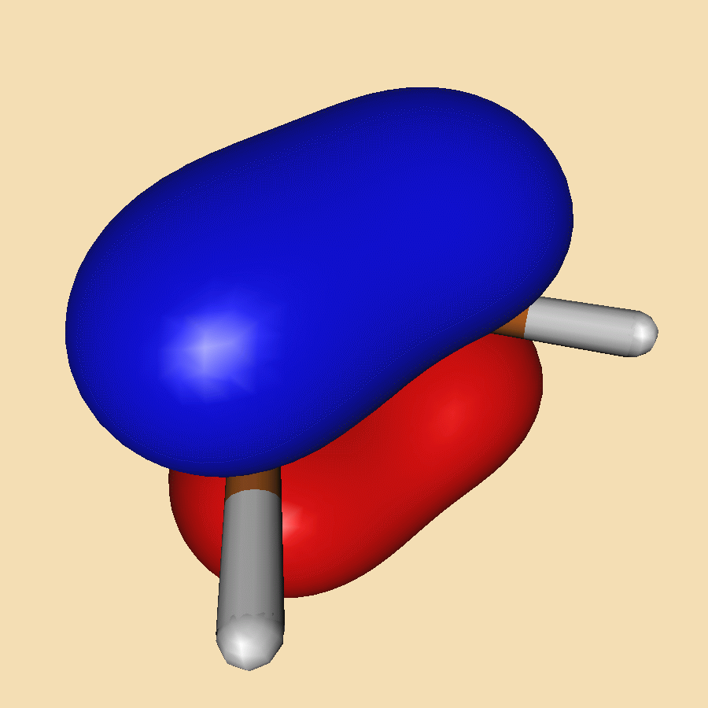

## 🚀 BAGEL Quick Start Tutorial

<details>
<summary><strong>⚙️ XMS-CAPT2 calculations with BAGEL</strong></summary>


Since XMS-CAPT2 calculations are rather time consuming we shall demonstrate the workflow based on ethylene example. We will perform geometry optimization at XMS-CAPT2 level of ethylene in the ground (N) and excited (V) state and locate selected conical intersetion geometries.

### 📦 Prerequisites

Before you begin, make sure you have:

- Access to a Unix/Linux shell
- Basic knowledge of terminal commands
- BAGEL package installed. It's available as a package in Debian and Ubuntu (`apt install BAGEL`) alternatively it may be downloaded and compiled - check out the official [installation guide](https://nubakery.org/quickstart/installation_guide.html).
- At WCSS you may copy a precompiled package from my directory. Using the same directory structure you won't have to edit the scripts.
```bash
mkdir -p ~/appl/bagel
cp -r ~rgora/appl/bagel/1.2.0-patch ~/appl/bagel
cp ~rgora/bin/Bagel ~/bin
cp ~rgora/bin/xyz2bagel.py ~/bin
```
- MOLDEN package installed

### 🧪 1. Create a Working Directory

```bash
mkdir -p ethylene/s0 && cd ethylene/s0
```

### 📄 2. Create an Input File

We need a starting geometry for ground state optimization. In such a case I often use [molget](https://github.com/jensengroup/molget) package from Jan Jensen's group (requires access to Open Babel package).
```bash
sub-interactive
module load openbabel
molget ethylene
exit
```
BAGEL uses JSON syntax for input files whic is rather tedious. You may use the [xyz2bagel.py](./assets/scripts/xyz2bagel.py) script to prepare a template of an input file:
```
xyz2bagel.py ethylene.xyz et_hf.json
cat et_hf.json
```
For the time being it prepares the structure along with a typical input for XMS-CASPT2 geometry optimization. 
```json
{
  "bagel": [
    {
      "title" : "molecule",
      "basis" : "svp",
      "df_basis" : "svp-jkfit",
      "angstrom" : true,
      "geometry" : [
        { "atom": "C", "xyz": [0.655, -0.0, -0.001] },
        { "atom": "C", "xyz": [-0.655, 0.0, -0.0005] },
        { "atom": "H", "xyz": [1.195, 0.9353, 0.0] },
        { "atom": "H", "xyz": [1.195, -0.9353, 0.0022] },
        { "atom": "H", "xyz": [-1.195, -0.9353, -0.0015] },
        { "atom": "H", "xyz": [-1.195, 0.9353, 0.0008] }
      ]
    },
    {
      "title" : "hf"
    },
    {
      "title" : "print",
      "file" : "hf.molden",
      "orbitals" : true
    },
    {
      "title" : "casscf",
      "nstate" : 2,
      "nact" : 2,
      "nclosed" : 7,
      "natocc" : true,
      "maxiter": 200,
      "maxiter_micro": 200,
      "active" : [ 8, 9 ]
    },
    {
      "title" : "print",
      "file" : "casscf.molden",
      "orbitals" : true
    },
    {
      "title" : "optimize",
      "target" : 1,
      "method" : [
        {
          "title" : "caspt2",
          "smith" : {
            "method" : "caspt2",
            "ms" : "true",
            "xms" : "true",
            "sssr" : "true",
            "shift" : 0.2,
            "frozen" : true,
            "maxiter" : 200
          },
          "nstate" : 2,
          "nact" : 2,
          "nclosed" : 7,
          "natocc" : true,
          "maxiter" : 400,
          "maxiter_micro" : 200,
          "active" : [ 8, 9 ]
        }
      ]
    },
    {
      "title" : "print",
      "file" : "final.molden",
      "orbitals" : true
    }
  ]
}
```
Naturally we have to start with HF calculations to setup the active space. Thus we shall keep only that part of the file.
```json
{
  "bagel": [
    {
      "title" : "molecule",
      "basis" : "svp",
      "df_basis" : "svp-jkfit",
      "angstrom" : true,
      "geometry" : [
        { "atom": "C", "xyz": [0.655, -0.0, -0.001] },
        { "atom": "C", "xyz": [-0.655, 0.0, -0.0005] },
        { "atom": "H", "xyz": [1.195, 0.9353, 0.0] },
        { "atom": "H", "xyz": [1.195, -0.9353, 0.0022] },
        { "atom": "H", "xyz": [-1.195, -0.9353, -0.0015] },
        { "atom": "H", "xyz": [-1.195, 0.9353, 0.0008] }
      ]
    },
    {
      "title" : "hf"
    },
    {
      "title" : "print",
      "file" : "hf.molden",
      "orbitals" : true
    }
  ]
}
```
You may now use the [Bagel](./assets/scripts/Bagel) script to submit the job to a queue. Once calculations are complete we may use `hf.molden` file to visualize the orbitals. In this case the choice is rather obvious. The V state of ethylene has a <sup>1</sup>ππ<sup>\*</sup> character, thus the minimal active space should consist of 2 electrons in 2 orbitals (HOMO and LUMO).

| {width=50}   | {width=100}   |
|---|---|
| Orbital 8 (π)           | Orbital 9 (π*)           | 

