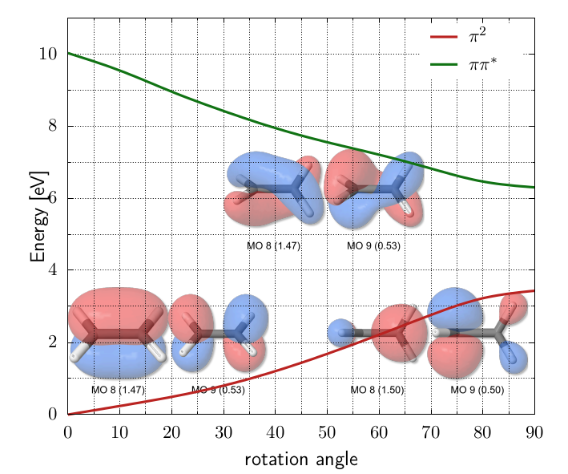

## 🚀 BAGEL Quick Start Tutorial

<details>
<summary><strong>⚙️ XMS-CAPT2 calculations with BAGEL</strong></summary>


Since XMS-CAPT2 calculations are rather time consuming we will demonstrate the workflow based on ethylene example. We will perform geometry optimization at XMS-CASPT2 level of ethylene in the ground (N) and excited (V) state and locate selected conical intersetion geometries.

### 📦 Prerequisites

Before you begin, make sure you have:

- Access to a Unix/Linux shell
- Basic knowledge of terminal commands
- BAGEL package installed. It's available as a package in Debian and Ubuntu (`apt install BAGEL`) alternatively it may be downloaded and compiled - check out the official [installation guide](https://nubakery.org/quickstart/installation_guide.html).
- At WCSS you may copy a precompiled package from my directory. Using the same directory structure you won't have to edit the scripts.
```bash
mkdir -p ~/appl/bagel
cp -r ~rgora/appl/bagel/1.2.0-patch ~/appl/bagel
cp ~rgora/bin/Bagel ~/bin
cp ~rgora/bin/xyz2bagel.py ~/bin
```
- MOLDEN package installed

### 🧪 1. Create a Working Directory

```bash
mkdir -p ethylene/s0 && cd ethylene/s0
```

### 📄 2. Create an Input File

We need a starting geometry for ground state optimization. In such a case I often use [molget](https://github.com/jensengroup/molget) package from Jan Jensen's group (requires access to Open Babel package).
```bash
sub-interactive
module load openbabel
molget ethylene
exit
```
BAGEL uses JSON syntax for input files which is rather tedious. You may use the [xyz2bagel.py](./assets/scripts/xyz2bagel.py) script to prepare a template of an input file:
```
xyz2bagel.py ethylene.xyz et_hf.json
cat et_hf.json
```
For the time being it prepares the structure along with a typical input for XMS-CASPT2 geometry optimization. 
```json
{
  "bagel": [
    {
      "title" : "molecule",
      "basis" : "svp",
      "df_basis" : "svp-jkfit",
      "angstrom" : true,
      "geometry" : [
        { "atom": "C", "xyz": [0.655, -0.0, -0.001] },
        { "atom": "C", "xyz": [-0.655, 0.0, -0.0005] },
        { "atom": "H", "xyz": [1.195, 0.9353, 0.0] },
        { "atom": "H", "xyz": [1.195, -0.9353, 0.0022] },
        { "atom": "H", "xyz": [-1.195, -0.9353, -0.0015] },
        { "atom": "H", "xyz": [-1.195, 0.9353, 0.0008] }
      ]
    },
    {
      "title" : "hf"
    },
    {
      "title" : "print",
      "file" : "hf.molden",
      "orbitals" : true
    },
    {
      "title" : "casscf",
      "nstate" : 2,
      "nact" : 2,
      "nclosed" : 7,
      "natocc" : true,
      "maxiter": 200,
      "maxiter_micro": 200,
      "active" : [ 8, 9 ]
    },
    {
      "title" : "print",
      "file" : "casscf.molden",
      "orbitals" : true
    },
    {
      "title" : "optimize",
      "target" : 1,
      "method" : [
        {
          "title" : "caspt2",
          "smith" : {
            "method" : "caspt2",
            "ms" : "true",
            "xms" : "true",
            "sssr" : "true",
            "shift" : 0.2,
            "frozen" : true,
            "maxiter" : 200
          },
          "nstate" : 2,
          "nact" : 2,
          "nclosed" : 7,
          "natocc" : true,
          "maxiter" : 400,
          "maxiter_micro" : 200,
          "active" : [ 8, 9 ]
        }
      ]
    },
    {
      "title" : "print",
      "file" : "final.molden",
      "orbitals" : true
    }
  ]
}
```

### 📄 3. Perform HF calculations and analyze the orbitals.

Naturally we have to start with HF calculations to setup the active space. Thus we shall keep only that part of the file.
```json
{
  "bagel": [
    {
      "title" : "molecule",
      "basis" : "svp",
      "df_basis" : "svp-jkfit",
      "angstrom" : true,
      "geometry" : [
        { "atom": "C", "xyz": [0.655, -0.0, -0.001] },
        { "atom": "C", "xyz": [-0.655, 0.0, -0.0005] },
        { "atom": "H", "xyz": [1.195, 0.9353, 0.0] },
        { "atom": "H", "xyz": [1.195, -0.9353, 0.0022] },
        { "atom": "H", "xyz": [-1.195, -0.9353, -0.0015] },
        { "atom": "H", "xyz": [-1.195, 0.9353, 0.0008] }
      ]
    },
    {
      "title" : "hf"
    },
    {
      "title" : "print",
      "file" : "hf.molden",
      "orbitals" : true
    }
  ]
}
```
You may now use the [Bagel](./assets/scripts/Bagel) script to submit the job to a queue. Once calculations are complete we may use `hf.molden` file to visualize the orbitals. 

MOLDEN is an obvious choice for visualization of this file though in principle [avogadro](https://avogadro.cc), [jmol](https://jmol.sourceforge.net) or [gOpenMol](https://github.com/gopenmoldev/gOpenMol) could be used as well. After opening `hf.molden` using for instance (I assume that the MOLDEN package is installed locally and the `hf.molden` file was copied to a current directory):
```
gmolden hf.molden
```
Now switch to `Dens. Mode`, choose a contour using `Space` button (e.g. 0.06) and then select an orbital from a window that appears after pressing `Orbital` button. BAGEL is labeling these starting from 1 so the labels will be the same in MOLDEN.

In this case the choice is rather obvious. The V state of ethylene has a <sup>1</sup>ππ<sup>\*</sup> character, thus the minimal active space should consist of 2 electrons in 2 orbitals (HOMO and LUMO). We have 8 doubly occupied orbitals in the RHF determinant thus we will make the HOMO and LUMO active and keep the remaining 7 inactive. 

|    |    |
|---|---|
| Orbital 8 (π)           | Orbital 9 (π*)           | 

### 📄 4. Ground state geometry optimization.

Once we have selected the active space we may proceed to ground and excited state geometry optimizations. We can use the original input file as a template and change it accordingly. Please note that the SVP basis set that we use is rather minimal and mainly for demonstration purposes (cc-pVDZ or if we can aford that cc-pVTZ would be a better choice). We have 2 active electrons (`"nact" : 2,`), 7 inactive doubly occupied orbitals (`"nclosed" : 7,`) and the active space composed of 8th and 9th orbitals (`"active" : [ 8, 9 ]`). To get a more balanced description of the states of interest we will perform state-averaged calculations in which we are averaging the densities of S0 and S1 states (`"nstate" : 2,`).

```bash
xyz2bagel.py ethylene.xyz et_s0_2in2.json
vi et_s0_2in2.json
cat et_s0_2in2.json
```
```json
{
  "bagel": [
    {
      "title" : "molecule",
      "basis" : "svp",
      "df_basis" : "svp-jkfit",
      "angstrom" : true,
      "geometry" : [
        { "atom": "C", "xyz": [0.655, -0.0, -0.001] },
        { "atom": "C", "xyz": [-0.655, 0.0, -0.0005] },
        { "atom": "H", "xyz": [1.195, 0.9353, 0.0] },
        { "atom": "H", "xyz": [1.195, -0.9353, 0.0022] },
        { "atom": "H", "xyz": [-1.195, -0.9353, -0.0015] },
        { "atom": "H", "xyz": [-1.195, 0.9353, 0.0008] }
      ]
    },
    {
      "title" : "hf"
    },
    {
      "title" : "casscf",
      "nstate" : 2,
      "nact" : 2,
      "nclosed" : 7,
      "natocc" : true,
      "maxiter": 200,
      "maxiter_micro": 200,
      "active" : [ 8, 9 ]
    },
    {
      "title" : "print",
      "file" : "casscf.molden",
      "orbitals" : true
    },
    {
      "title" : "optimize",
      "target" : 0,
      "internal" : false,
      "method" : [
        {
          "title" : "caspt2",
          "smith" : {
            "method" : "caspt2",
            "ms" : "true",
            "xms" : "true",
            "sssr" : "true",
            "shift" : 0.0,
            "frozen" : true,
            "maxiter" : 200
          },
          "nstate" : 2,
          "nact" : 2,
          "nclosed" : 7,
          "natocc" : true,
          "maxiter" : 400,
          "maxiter_micro" : 200,
          "active" : [ 8, 9 ]
        }
      ]
    },
    {
      "title" : "print",
      "file" : "final.molden",
      "orbitals" : true
    }
  ]
}
```

Bagel produces `opt_history.molden` showing a trajectory. More details can be found in opt.log (these file names are predefined thus it is advisable to perform calculations in dedicated directories). Look for `ci vector` after `=== FCI iteration ===` to check the character of both states. In this case the interpretation is rather obvious. The S0 state has a $^1\pi^2$ character, while the excited state is a $^1\pi\pi^*$ transition. Please note that the main output file contains the details of the first optimization cycle while the consecutive, including final are reported in `opt.log`. 

```
  === FCI iteration ===
[...]
      1  0 *     -77.99480267     4.45e-16      0.00
      1  1 *     -77.62677001     1.94e-16      0.00

     * ci vector, state   0, <S^2> = 0.0000
       2.     0.9827768386
       .2    -0.1847963350

     * ci vector, state   1, <S^2> = 0.0000
       ab    -0.7071067812
       ba    -0.7071067812
```

The relevant XMS-CASPT2 energies are printed below:
```
    * MS-CASPT2 energy : state  0      -78.2578743786
    * MS-CASPT2 energy : state  1      -77.9487462336
``` 

Some interesting data can also be found in the `casscf.log` - in particular the natural occupation numbers:
```
  ========       state-averaged       ========
  ======== natural occupation numbers ========
   Orbital 0 : 1.4659
   Orbital 1 : 0.5341
  ============================================
```

### 📄 5. Excited state geometry optimization.

Perhaps the most comprehensive description of ethylene PE landscape was given by Barbatti et al.[^1] We will attempt to locate the $D_{2d}$ geometry of the V state assuming the corresponding wavefunction i.e. `XMS-CASPT2(2,2)/def2-SVP`. We neet to prepare the appropriate starting geometry (please note thet if you start with the ground state geometry the calculations probably won't converge or even dissociate the molecule into two methylene radicals). Below is the starting geometry prepared using MOLDEN.

```
6

C     0.655000     0.000000    -0.001000
C    -0.655000     0.000000    -0.000500
H     1.195000     0.935300     0.000000
H     1.195000    -0.935300     0.002200
H    -1.194643    -0.001206     0.935006
H    -1.195357     0.001206    -0.935594
```


```bash
xyz2bagel.py ethylene_d2d.xyz et_s1_2in2.json
vi et_s1_2in2.json
cat et_s1_2in2.json
```

The input file will be rather similar. We have 2 active electrons (`"nact" : 2,`), 7 inactive doubly occupied orbitals (`"nclosed" : 7,`) and the active space composed of 8th and 9th orbitals (`"active" : [ 8, 9 ]`). To get a more balanced description of the states of interest we will perform state-averaged calculations in which we are averaging the densities of S0 and S1 states (`"nstate" : 2,`). To select the S1 state we change the target from 0 to 1 (`"target" : 1,`). Bagel is labeling states starting from `0` while the orbitals starting from `1`. Also note that I have switched to optimization in cartesian coordinates (`"internal" : false,`) - in my experience the optimization in internal coordinates is often unsuccessful.

```json
{
  "bagel": [
    {
      "title" : "molecule",
      "basis" : "svp",
      "df_basis" : "svp-jkfit",
      "angstrom" : true,
      "geometry" : [
        { "atom": "C", "xyz": [0.655, 0.0, -0.001] },
        { "atom": "C", "xyz": [-0.655, 0.0, -0.0005] },
        { "atom": "H", "xyz": [1.195, 0.9353, 0.0] },
        { "atom": "H", "xyz": [1.195, -0.9353, 0.0022] },
        { "atom": "H", "xyz": [-1.194643, -0.001206, 0.935006] },
        { "atom": "H", "xyz": [-1.195357, 0.001206, -0.935594] }
      ]
    },
    {
      "title" : "hf"
    },
    {
      "title" : "casscf",
      "nstate" : 2,
      "nact" : 2,
      "nclosed" : 7,
      "natocc" : true,
      "maxiter": 200,
      "maxiter_micro": 200,
      "active" : [ 8, 9 ]
    },
    {
      "title" : "print",
      "file" : "casscf.molden",
      "orbitals" : true
    },
    {
      "title" : "optimize",
      "target" : 1,
      "internal" : false,
      "method" : [
        {
          "title" : "caspt2",
          "smith" : {
            "method" : "caspt2",
            "ms" : "true",
            "xms" : "true",
            "sssr" : "true",
            "shift" : 0.0,
            "frozen" : true,
            "maxiter" : 200
          },
          "nstate" : 2,
          "nact" : 2,
          "nclosed" : 7,
          "natocc" : true,
          "maxiter" : 400,
          "maxiter_micro" : 200,
          "active" : [ 8, 9 ]
        }
      ]
    },
    {
      "title" : "print",
      "file" : "final.molden",
      "orbitals" : true
    }
  ]
}
```

Again our description of the V state is lacking as it has a significant 3d contribution. In this simplified $\pi$-orbital picture $`\psi_V=|\pi^{\alpha}\pi^{*\beta}\rangle - |\pi^{\beta}\pi^{*\alpha}\rangle`$, however, after rotation to $D_{2d}$ symmetry the frontier $\pi$ orbitals become degenerated. Below there is a plot for the interpolated geometries between $D_{2h}$ and $D_{2d}$ geometries. Only the SA-CASSCF(2,2)/def2-SVP energies are shown. The orbital plots were prepared using [mopicgen](https://github.com/eljost/mopicgen) package (the [templates](assets/scripts/mopicgen) I've used should be put into the local mopicgen templates directory):
```bash
mopicgen casscf.molden --orient "reset;center {0,0,0} ; rotate z 0; rotate y 0; rotate x -45;" --fracmos
bash run.sh
```
The CASSCF natural orbitals are shown for 0, 40 and 90 deegrees. The table below indicates a significant change in the orbital character roughly between 70 and 80 degrees. At 90 degrees the V state becomes degenerate with the Z state, the latter is particularly stabilized due to a closed shell character (this is visible at the CASPT2 level). In fact we should rather use SA3-CASSCF reference but this calculations are just to demonstrate the BAGEL capabilities.

| Angle  | State | Energy | CI vector | State | Energy | CI vector |
|---|---|---|---|---|---|---|
| 0 |S0 |-77.99449359 |`2.` 0.98, `.2` -0.18 |                       S1 |-77.62624295 |`ab` -0.707, `ba` -0.707 |
|40 |S0 |-77.95020452 |`2.` 0.98, `.2` -0.17 |                       S1 |-77.70261305 |`ab` -0.707, `ba` -0.707 |
|70 |S0 |-77.89295023 |`2.` -0.62, `ab` 0.55 `ba` 0.55, `.2` 0.06 |  S1 |-77.74384077 |`2.` -0.777, `ab` -0.44, `ba` -0.44, `.2` 0.075 |
|80 |S0 |-77.87595738 |`ab` 0.66, `ba` 0.66, `2.` 0.35 |             S1 |-77.75707346 |`2.` 0.93, `ab` -0.25, `ba` -0.25 |
|90 |S0 |-77.86833139 |`ab` 0.707, `ba` 0.707 |                      S1 |-77.76302595 |`2.` -0.99 |




### 📄 6. Minimum energy conical intersection geometry optimization.

In fact there are several[^1] but we shall locate only one - ethylidene. We may start from the geometry located using ADC(2) method:

```
6

C      0.01079222      0.08027695     -0.43180471
C     -0.40307060     -0.08212021      0.95179399
H      1.09058540     -0.17053498     -0.52947412
H     -0.11219892      1.11924180     -0.80265530
H     -0.53731942     -0.58657682     -1.12948604
H     -0.04878867     -0.35928674      1.94262617
```

We need to edit the template. To select the states of interest we specify `"target" : 0,` and `"target2" : 1,`. We also have to change the `"opttype" : "meci",`.

```bash
xyz2bagel.py etdn.xyz etdn_s1-s0_2in2.json
vi etdn_s1-s0_2in2.json
cat etdn_s1-s0_2in2.json
```

```json
{
  "bagel": [
    {
      "title" : "molecule",
      "basis" : "svp",
      "df_basis" : "svp-jkfit",
      "angstrom" : true,
      "geometry" : [
        { "atom": "C", "xyz": [0.01079222, 0.08027695, -0.43180471] },
        { "atom": "C", "xyz": [-0.4030706, -0.08212021, 0.95179399] },
        { "atom": "H", "xyz": [1.0905854, -0.17053498, -0.52947412] },
        { "atom": "H", "xyz": [-0.11219892, 1.1192418, -0.8026553] },
        { "atom": "H", "xyz": [-0.53731942, -0.58657682, -1.12948604] },
        { "atom": "H", "xyz": [-0.04878867, -0.35928674, 1.94262617] }
      ]
    },
    {
      "title" : "hf"
    },
    {
      "title" : "print",
      "file" : "hf.molden",
      "orbitals" : true
    },
    {
      "title" : "casscf",
      "nstate" : 2,
      "nact" : 2,
      "nclosed" : 7,
      "natocc" : true,
      "maxiter": 200,
      "maxiter_micro": 200,
      "active" : [ 8, 9 ]
    },
    {
      "title" : "print",
      "file" : "casscf.molden",
      "orbitals" : true
    },
    {
      "title" : "optimize",
      "target" : 0,
      "target2" : 1,
      "opttype" : "meci",
      "internal" : "false",
      "method" : [
        {
          "title" : "caspt2",
          "smith" : {
            "method" : "caspt2",
            "ms" : "true",
            "xms" : "true",
            "sssr" : "true",
            "shift" : 0.2,
            "frozen" : true,
            "maxiter" : 200
          },
          "nstate" : 2,
          "nact" : 2,
          "nclosed" : 7,
          "natocc" : true,
          "maxiter" : 400,
          "maxiter_micro" : 200,
          "active" : [ 8, 9 ]
        }
      ]
    },
    {
      "title" : "print",
      "file" : "final.molden",
      "orbitals" : true
    }
  ]
}
```

The final geometry (E=-78.0858604633) was located after only 14 steps. 

```
    6

 C     0.010534     0.080121    -0.430655
 C    -0.386064    -0.084432     0.941822
 H     1.091719    -0.178578    -0.482105
 H    -0.081402     1.112052    -0.818571
 H    -0.504379    -0.589801    -1.144698
 H    -0.214152    -0.326018     1.979319
```

[^1]: [Barbatti, M.; Paier, J.; Lischka, JCP 2004, 121 (23), 11614–11624](https://doi.org/10.1063/1.1807378).

