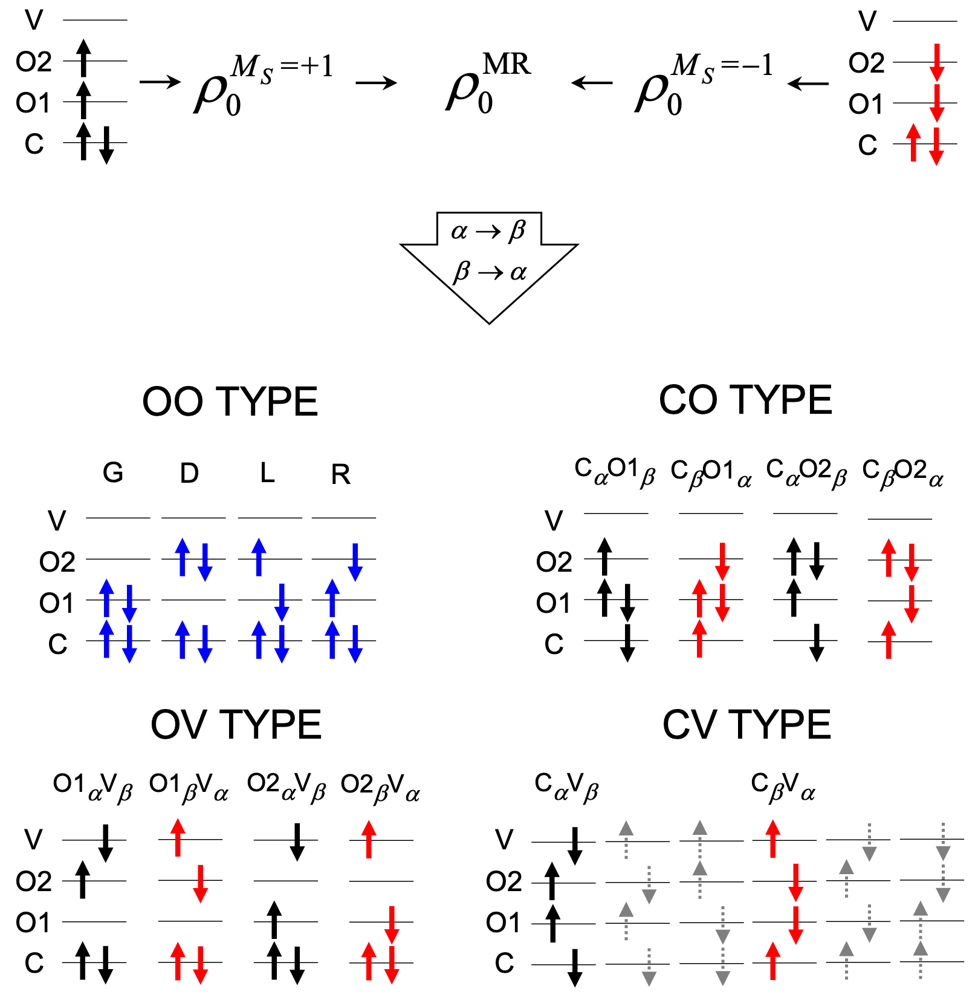

## 🚀 GAMESS Quick Start Tutorial

<details>
<summary><strong>⚙️ MRSF-TDDFT calculations with GAMESS</strong></summary>


Again, for purely demonstrational purposes we will demonstrate the workflow based on ethylene example. We will perform geometry optimization at MRSF-TDDFT level of ethylene in the ground (N) and excited (V) state and locate selected conical intersetion geometries.

### 📦 Prerequisites

Before you begin, make sure you have:

- Access to a Unix/Linux shell
- Basic knowledge of terminal commands
- GAMESS(US) package installed. It may be downloaded and compiled
  after registration - check out the official [download page ](https://www.msg.chem.iastate.edu/gamess/License_Agreement.html).
- At WCSS you may copy a precompiled package from my directory. Using the same directory structure you won't have to edit the scripts.
- [Understanding of MRSF-TDDFT Theory](https://mqcp.readthedocs.io/en/latest/mrsf.html)
```bash
mkdir -p ~/appl/gamess
cp -r ~rgora/appl/gamess/2024-07-15_r2 ~/appl/gamess
cp ~rgora/bin/Gamess ~/bin
cp ~rgora/bin/xyz2gms.py ~/bin
```
- MOLDEN package installed

### 🧪 1. Create a Working Directory

```bash
mkdir -p ethylene/s0 && cd ethylene/s0
```

### 📄 2. Create an Input File

We can simply copy the XYZ files from BAGEL calculations.
GAMESS syntax is also oldfashioned (it was written mostly using FORTRAN 77 standard). You may use the [xyz2gms.py](./assets/scripts/xyz2gms.py) script to prepare a template of an input file. Executed without parameters returns syntax:

```bash
xyz2gms.py
```
```
This script prepares a set of
input files for each xyz structure provided as an
input. An input template is required. If none is found a standard
one is prepared.

If -g (--grep) option is used the data files should be the log files from which
the energies are extracted.

Usage: xyz2gzm.py [options] *.xyz or *.log file(s)

Options:
  -h, --help       show this help
  -g, --grep       extract energies from logs
  -e, --eds        prepare files for EDS analysis
  -m, --mrsf       prepare files for MRSF calculations

```
The script expects a separate template file but it will punch one if it's not in the current directory.
```bash
xyz2gms.py -m ethylene.xyz
```
```
There's no mrsf template. I'm punching one - please check
```
We need to edit the `mrsf.tmpl` file:
```
 $contrl scftyp=rohf runtyp=conical dfttyp=bhhlyp icharg=0
         tddft=mrsf maxit=400 mult=3 nprint=7 units=angs
         icut=20 itol=30 qmttol=1.0e-05 ispher=1 $end
 $conicl ixroot(1)=1,2 $end
 $tddft nstate=3 iroot=1 $end
 $scf dirscf=.t. fdiff=.f. diis=.t. soscf=.f.
      conv=1d-7 ethrsh=2.0 swdiis=0.005 cuhf=.t.
      shift=.t. damp=.t. npreo(1)=1,-1,2,1 $end
 $punch molden=.true. $end
 $dft swoff=0d-0 switch=0d-0 nrad0=96 nleb0=302
      nrad=99 nleb=590 $end
 $tddft nrad=99 nleb=590 $end
 $guess guess=huckel $end
 $basis gbasis=n31 ngauss=6 ndfunc=1 $end
 $system timlim=999999100 mwords=100 $end
@data
```

### 📄 3. Ground state geometry optimization.

The one above is a bit paranoid. We should obtain reliable results using the one below, but in difficult cases it may help with SCF convergence issues. Also it is for MECI optimization. For the ground state we need `runtype=optimize`. In the `$tddft` block we should pick `iroot=1` (this is spin-flip calculation based on triplet ROKS reference so the ground state is computed as an `excitation`). The essential advantage of MRSF-TDDFT is that it considers both $M_S=+1$ and $M_S=-1$ components of the triplet reference. This is shown schematically in the chart below from [Cheol Ho Choi tutorial](https://mqcp.readthedocs.io/en/latest/mrsf.html).



```
 $contrl scftyp=rohf runtyp=optimize dfttyp=bhhlyp icharg=0
         tddft=mrsf maxit=400 mult=3 nprint=7 units=angs
         qmttol=1.0e-05 ispher=1 $end
 $conicl ixroot(1)=1,2 $end
 $tddft nstate=3 iroot=1 $end
 $scf dirscf=.f. fdiff=.f. diis=.t. soscf=.f.
      conv=1d-6 ethrsh=2.0 swdiis=0.005 cuhf=.t.
      shift=.t. damp=.t. npreo(1)=1,-1,2,1 $end
 $punch molden=.true. $end
 $dft swoff=0d-0 switch=0d-0 nrad0=96 nleb0=302
      nrad=96 nleb=302 $end
 $tddft nrad=96 nleb=302 $end
 $guess guess=huckel $end
 $basis gbasis=n31 ngauss=6 ndfunc=1 $end
 $system timlim=999999100 mwords=100 $end
@data
 ```

Again the 6-31G* basis set that we use is rather small and mainly for demonstration purposes. The `BH&HLYP` functional is sort of a standard for SF calculations though any functional with large HF exchange contribution would do.

```bash
xyz2gms.py -m ethylene.xyz
vi ethylene_mrsf.inp
cat ethylene_mrsf.inp
```
```
 $contrl scftyp=rohf runtyp=optimize dfttyp=bhhlyp icharg=0
         tddft=mrsf maxit=400 mult=3 nprint=7 units=angs
         qmttol=1.0e-05 ispher=1 $end
 $conicl ixroot(1)=1,2 $end
 $tddft nstate=3 iroot=1 $end
 $scf dirscf=.f. fdiff=.f. diis=.t. soscf=.f.
      conv=1d-6 ethrsh=2.0 swdiis=0.005 cuhf=.t.
      shift=.t. damp=.t. npreo(1)=1,-1,2,1 $end
 $punch molden=.true. $end
 $dft swoff=0d-0 switch=0d-0 nrad0=96 nleb0=302
      nrad=96 nleb=302 $end
 $tddft nrad=96 nleb=302 $end
 $guess guess=huckel $end
 $basis gbasis=n31 ngauss=6 ndfunc=1 $end
 $system timlim=999999100 mwords=100 $end
 $data
ethylene.xyz
c1 0
C       6.0         0.65500        -0.00000        -0.00100
C       6.0        -0.65500         0.00000        -0.00050
H       1.0         1.19500         0.93530         0.00000
H       1.0         1.19500        -0.93530         0.00220
H       1.0        -1.19500        -0.93530        -0.00150
H       1.0        -1.19500         0.93530         0.00080
 $end
```

`Molden` and `Avogadro` read the GAMESS outputs. In this case the geometry was located after 20 steps. The details of SF calculations are specified as follows:

```
     -----------------------------------
     SPIN-ADAPTED SPIN-FLIP EXCITATIONS
     -----------------------------------

 STATE #   1  ENERGY =   -4.268268 EV
 SYMMETRY OF STATE   =    A
 S-SQUARED           =    0.0000
        DRF    COEF         OCC       VIR
        ---    ----       ------    ------
          9 -0.990347         9  ->     8
         17 -0.125427         8  ->     9

 STATE #   2  ENERGY =    4.108462 EV
 SYMMETRY OF STATE   =    A
 S-SQUARED           =    0.0000
        DRF    COEF         OCC       VIR
        ---    ----       ------    ------
          8 -0.994968         8  ->     8
         79 -0.050063         8  ->    16
         98  0.080346         9  ->    18
```
State 1 has negative energy because it lies below the open-shell triplet reference. It clearly the ground state with doubly occupied orbitals 1..8 (the meaning of OCC -> VIR is that $\alpha$ electron in 9th orbital is flipped to $\beta$ in 8th. Below there's a summary of MRSF-TDDFT results:

```
          ----------------------------
          SUMMARY OF MRSF-DFT RESULTS
          ----------------------------

   STATE             ENERGY     EXCITATION      <S^2>    TRANSITION DIPOLE, A.U.  OSCILLATOR
                    HARTREE         EV                      X        Y        Z    STRENGTH

 1 NEGATIVE ROOT(S) FOUND.
   1  A          -78.5251761600   -4.268        0.0000   0.0000   0.0000   0.0000   0.0000
   0  A          -78.3683201757    0.000               (REFERENCE STATE)
   2  A          -78.2173369734    4.108        0.0000   1.6808   0.0002   0.0003   0.5798
   3  A          -78.2140536052    4.198        0.0000   0.0032  -0.0000   0.0000   0.0000
```
The ground state energy is -78.5251761600.

### 📄 4. Excited state geometry optimization.

### 📄 5. Minimum energy conical intersection geometry optimization.

