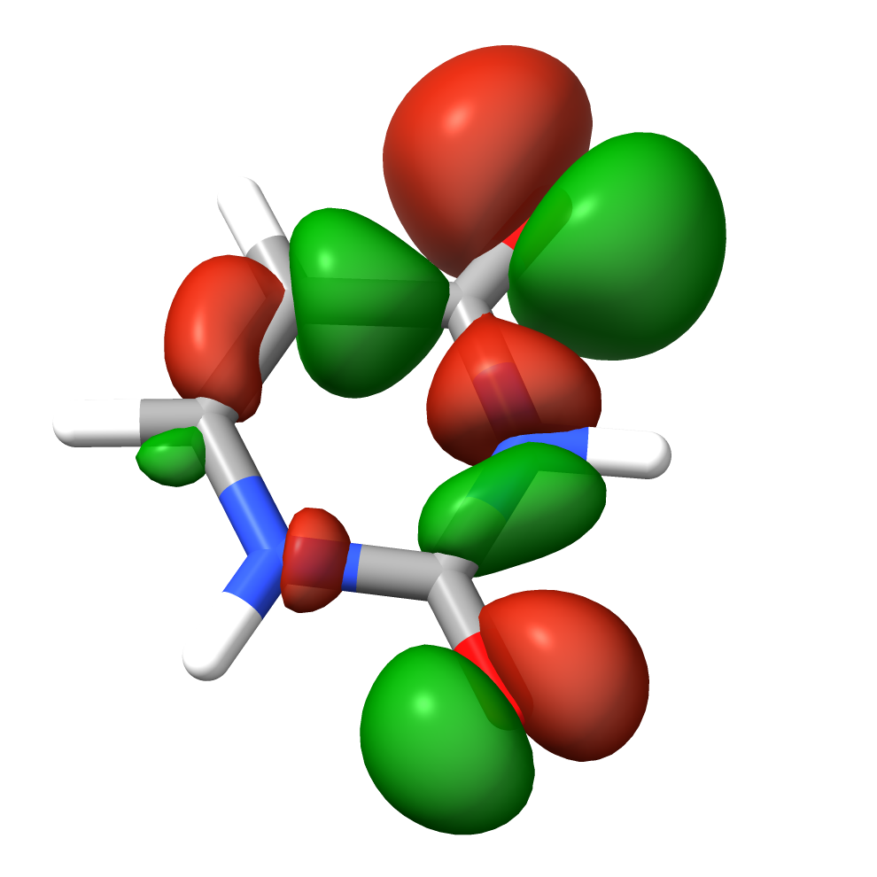
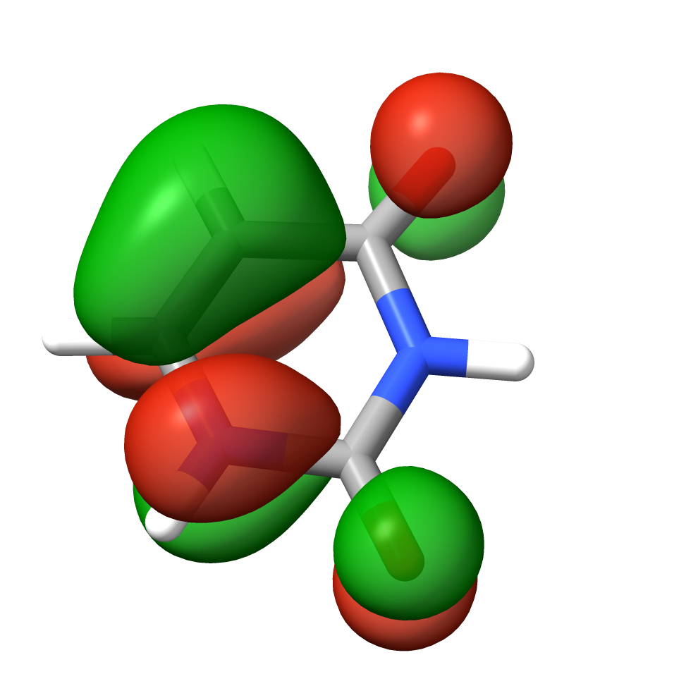
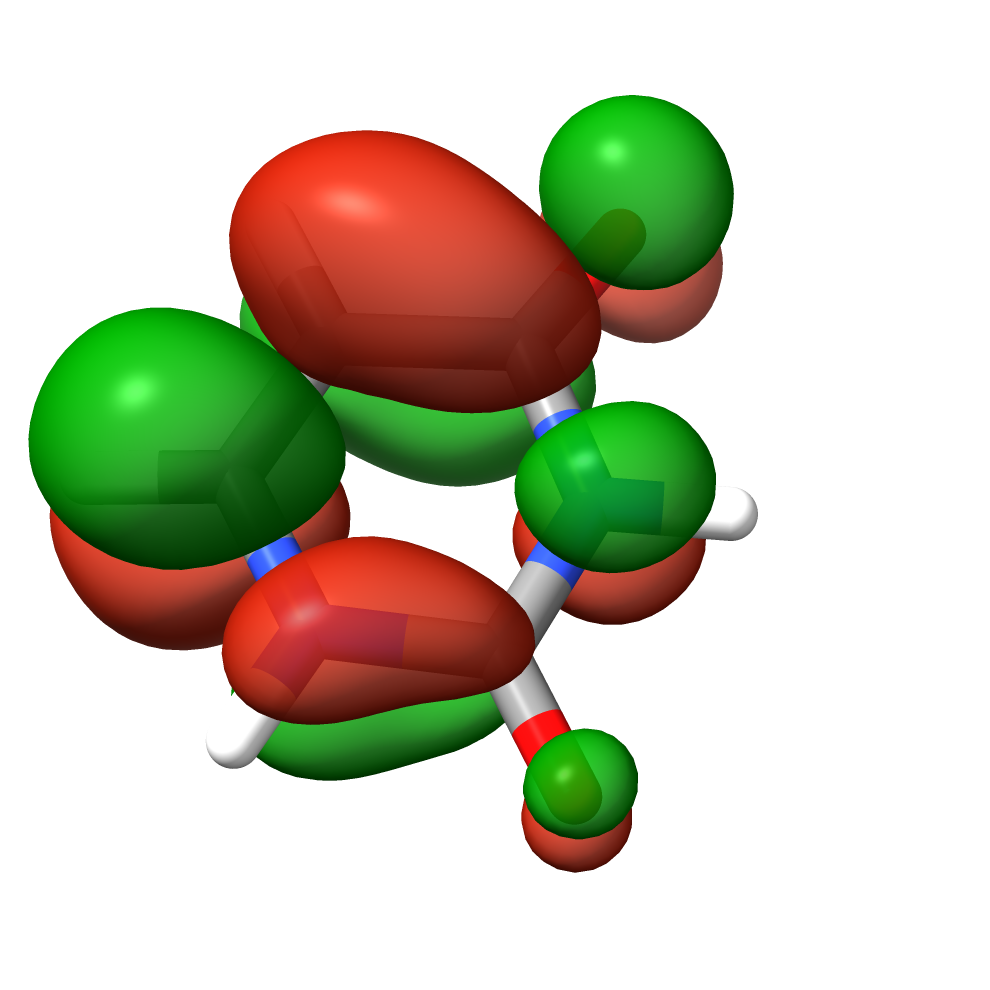

# ORCA Tutorial: Geometry Optimization & UV-vis Spectra of Uracil, Cytosine and Thymine

This tutorial outlines the steps to optimize the geometry of U, T and C nucleobases and compute their vertical excitation spectra using ORCA 6.0.1 package.

## Prerequisites

- **ORCA Installation**: Ensure ORCA is installed on your system. [Installation Guide](https://www.faccts.de/docs/orca/6.0/tutorials/installing-orca.html)
- **Input Files**: Prepare the molecular structure of uracil in an appropriate format (e.g., `.xyz` or `.pdb`).

## Step 1: Geometry Optimization

Create an input file named `uracil_s0.inp` with the following content:

```plaintext
! pbe0 d4 def2-SVP Opt RIJCOSX Def2/J defgrid3 TightSCF

%geom
    MaxIter 200
    #Convergence tight
end

* xyz 0 1
C   0.7161260117   0.9937054230   0.5446110515  
N   1.5295535430   0.0964202102  -0.1547034571  
C   1.1486238151  -1.1902113468  -0.5167547652  
N  -0.1416009934  -1.5743016712  -0.1391606333  
C  -1.0041440815  -0.7553883162   0.5491894544  
C  -0.6222418826   0.5095480268   0.9031977090  
O   1.8970629335  -1.9704453009  -1.1408395844  
H  -1.2681643439   1.1883874522   1.4453994906  
O   1.1473685821   2.1235378362   0.8224609717  
H   2.4633281615   0.3946765571  -0.4201853029  
H  -0.4305344904  -2.5115764067  -0.3988396958  
H  -2.0011471316  -1.1451087139   0.8039473321  
*
```

**Explanation**:

- `! pbe0 d4 def2-SVP Opt`: Specifies the use of the PBE0 hybrid functional with the def2-SVP basis set and D4 empirical dispersion for geometry optimization.
- The `* xyz 0 1` block defines the molecular geometry in Cartesian coordinates with a charge of 0 and a multiplicity of 1.

Run the optimization. We could either start an interactive session, load appropriate module and run interactive job:

```bash
sub-interactive
module load ORCA/6.0.1_avx2
orca uracil_s0.inp > uracil_s0.out &
tail -f uracil_s0.out
```
or submit orca job to the SLURM queuing system. We shall normally use the latter approach. In this case the geometry we'll be given in an external file and we'll use 16 cores to speed the calculations and use up to 2000mb per core:

```plaintext
%pal nprocs 16 end
%maxcore 2000
! pbe0 d4 def2-SVP Opt RIJCOSX Def2/J defgrid3 TightSCF

%geom
    MaxIter 200
    #Convergence tight
end

* xyzfile 0 1 uracil_s0_s.xyz 

```

where `uracil_s0_s.xyz` is a regular XYZ file. 

We may submit the job using `sub-orca-6.0.1-avx2` command, which issued without parameters returns it's syntax:

```bash
sub-orca-6.0.1-avx2

orca-6.0.1-avx

Usage: /usr/local/bin/bem2/sub-orca-6.0.1-avx2 FILE PARAMETERS
Parameters:
	-p PARTITION 		 Set partition (queue). Default = normal
	-n NODES 		 Set number of nodes. Default = 1
	-c CORES 		 Up to 48. Default = 6
	-m MEMORY 		 In GB, up to 180 (must be integer value). Default = 30
	-t TIME_LIMIT 		 In hours. Default = 12
```

So to submit our job we should issue the following command (16 cpus times roughly 2gb gives 32gb and we extend the timelimit to 72h of walltime):

```bash
sub-orca-6.0.1-avx2 uracil_s0.inp -c 16 -m 32 -t 72
```

This produces the following output:

```bash
orca-6.0.1-avx

Submitted batch job 3469149
The job is being submitted with the following parameters:

	file            uracil_s0.inp
	partition    normal
	nodes        1
	cores per node 16
	memory       32 GB (per node)
	time limit   72 hours
```

We may monitor our job using `squeue` command:

```bash
squeue --user $USER
```
or even fancier:
```bash
squeue --user $USER --Format jobid:10,name,state:10,timeleft:12,minmemory:10,stdout:100'
```

After completion, the optimized geometry can be found in the output file `uracil_s0.out` (actually the sub-orca script is producing *.orc files but please change that to *.out). Please note that if you use the same filename for XYZ file, that is uracil_s0.inp and uracil_s0.xyz, the latter will be overwritten with the final geometry.

We may use `sacct` command to see the detailed info on the resources used (3470106 is the uniqe job-id):

```bash
sacct --format=jobid,jobname,qos,cputime,ncpu,avecpu,elapsed,avevmsize --jobs=3470106

JobID           JobName        QOS    CPUTime      NCPUS     AveCPU    Elapsed  AveVMSize
------------ ---------- ---------- ---------- ---------- ---------- ---------- ----------
3470106       uracil_s0 hpc-rgora+   00:17:36         16              00:01:06
3470106.bat+      batch              00:17:36         16   00:15:19   00:01:06    911984K
3470106.ext+     extern              00:17:36         16   00:00:00   00:01:06        72K

```

which shows that this job used 17min of cpu time and took roughly 1m.

## Step 2: Vertical Excitation Spectrum Calculation

Using the optimized geometry, create a new input file named `uracil_s0_vee.inp`:

```plaintext
%pal nprocs 16 end
%maxcore 2000
! pbe0 d4 def2-SVP Opt RIJCOSX Def2/J defgrid3 TightSCF

%output
    print[p_mos] 1
    print[p_basis] 2
end

%tddft
    TDA true # TDA approx
    NRoots 8 # number of electronic states
    IRoot 1 # state of interest for calculation of properties
    FollowIRoot true # relevant for excited state geometries
    DoNTO true # for Natural Transition Orbitals
end

* xyzfile 0 1 uracil_s0.xyz
```

Run the TDDFT calculation:

```bash
sub-orca-6.0.1-avx2 uracil_s0_vee.inp -c 16 -m 32 -t 72
```

The vertical excitation energies and oscillator strengths will be reported in the `uracil_s0_vee.out` file. Let us focus on the first two low lying states (S1 and S2).

```plaintext
------------------------------------
TD-DFT/TDA EXCITED STATES (SINGLETS)
------------------------------------

the weight of the individual excitations are printed if larger than 1.0e-02

STATE  1:  E=   0.178366 au      4.854 eV    39146.9 cm**-1 <S**2> =   0.000000 Mult 1
    25a ->  29a  :     0.021596 (c=  0.14695663)
    27a ->  29a  :     0.921544 (c=  0.95997092)
    27a ->  30a  :     0.038202 (c=  0.19545282)
    27a ->  34a  :     0.010999 (c=  0.10487478)

STATE  2:  E=   0.209709 au      5.706 eV    46025.8 cm**-1 <S**2> =   0.000000 Mult 1
    24a ->  29a  :     0.012566 (c= -0.11209819)
    24a ->  30a  :     0.014197 (c=  0.11915057)
    26a ->  29a  :     0.072479 (c=  0.26921873)
    26a ->  30a  :     0.066171 (c=  0.25723737)
    28a ->  29a  :     0.799539 (c=  0.89416965)
    28a ->  34a  :     0.011285 (c=  0.10623135)

[...]

---------------------------------------------------------------------------------------------------
                     ABSORPTION SPECTRUM VIA TRANSITION ELECTRIC DIPOLE MOMENTS
---------------------------------------------------------------------------------------------------
     Transition      Energy     Energy  Wavelength fosc(D2)      D2        DX        DY        DZ
                      (eV)      (cm-1)    (nm)                 (au**2)    (au)      (au)      (au)
---------------------------------------------------------------------------------------------------
  0-1A  ->  1-1A    4.853593   39146.9   255.4   0.000239959   0.00202   0.01607  -0.01595   0.0388
  0-1A  ->  2-1A    5.706475   46025.8   217.3   0.159270387   1.13922   0.19741   0.99831   0.3219

```

The results are most conveniently visualized using This can be done easily by using [ChimeraX](https://www.faccts.de/docs/orca/6.0/tutorials/first_steps/GUI.html) using the SEQCROW plugin. Open the output file in ChimeraX, then go navigate to `Tools` → `Quantum Chemistry` → `UV/Vis Spectrum`. In the UV/Vis Spectrum window, you can now chose energy for weighting: electronic from the respective drop down menu and the respective plot is visualized under plot. The relevant orbitals can be plotted using the `Orbital Viewer` panel (please note that ORCA is counting from 0 and most visualization programs from 1, thus 28th orbital in ORCA output is actually 29th in ChimeraX.

To copy the files to our local terminal we may use `scp` command (or use MobaXterm sftp functionality). I'll copy all *xyz, *inp and *orc files starting with uracil_s0 to my current directory (.) and rename all *.orc files to *.out:

```bash
scp rgora@ui.wcss.pl:~/photochemistry/uracil/uracil_s0*.{xyz,orc,inp} .
for f in *.orc ; do mv $f ${f/orc/out}; done
```

The S<sub>1</sub> is clearly a <sup>1</sup>nπ<sup>\*</sup> transition (27->29) while S<sub>2</sub> has a <sup>1</sup>ππ<sup>\*</sup> character.

|    |    |    |
|---|---|---|
| Orbital 27 (n)           | Orbital 28 (π)           | Orbital 29 (π*)           |

In this case it is rather obvious but sometimes we may encounter a transition with two 9or more) different and equally important amplitudes. In such a case NTOs are usually much more informative. Since we enabled calculation of NTOs via `DoNTO true` keyword, ORCA produced uracil_s0_vee.s?.nto files. Let us generate the cube files for S1 and S2:

```bash
sub-interactive
module load ORCA/6.0.1_avx2
orca_plot uracil_s0_vee.s1.nto -i 
```

The relevant NTOs for state S1 are 28 (hole) and 29 (particle):

```plaintext
------------------------------------------
NATURAL TRANSITION ORBITALS FOR STATE    1
------------------------------------------
[...]
 E=   0.178366 au      4.854 eV    39146.9 cm**-1
    28a ->  29a  : n=  0.99676652
    27a ->  30a  : n=  0.00247915
```

Thus in the interactive mode we select orbital (option 2) and type the orbital no (28), then we select cube output (option 5 and then 7), save the cube file (option 11). Then we repeat the same procedure for orbital 29 and exit (option 12). Now we generate cube files for NTOs 28 and 29 for S2 state and copy the relevant files to our local terminal.

```bash
scp rgora@ui.wcss.pl:~/photochemistry/uracil/uracil_s0_vee*.{nto,cube} .
```


## References

For more detailed information, refer to the [ORCA 6.0 Tutorials](https://www.faccts.de/docs/orca/6.0/tutorials/).
