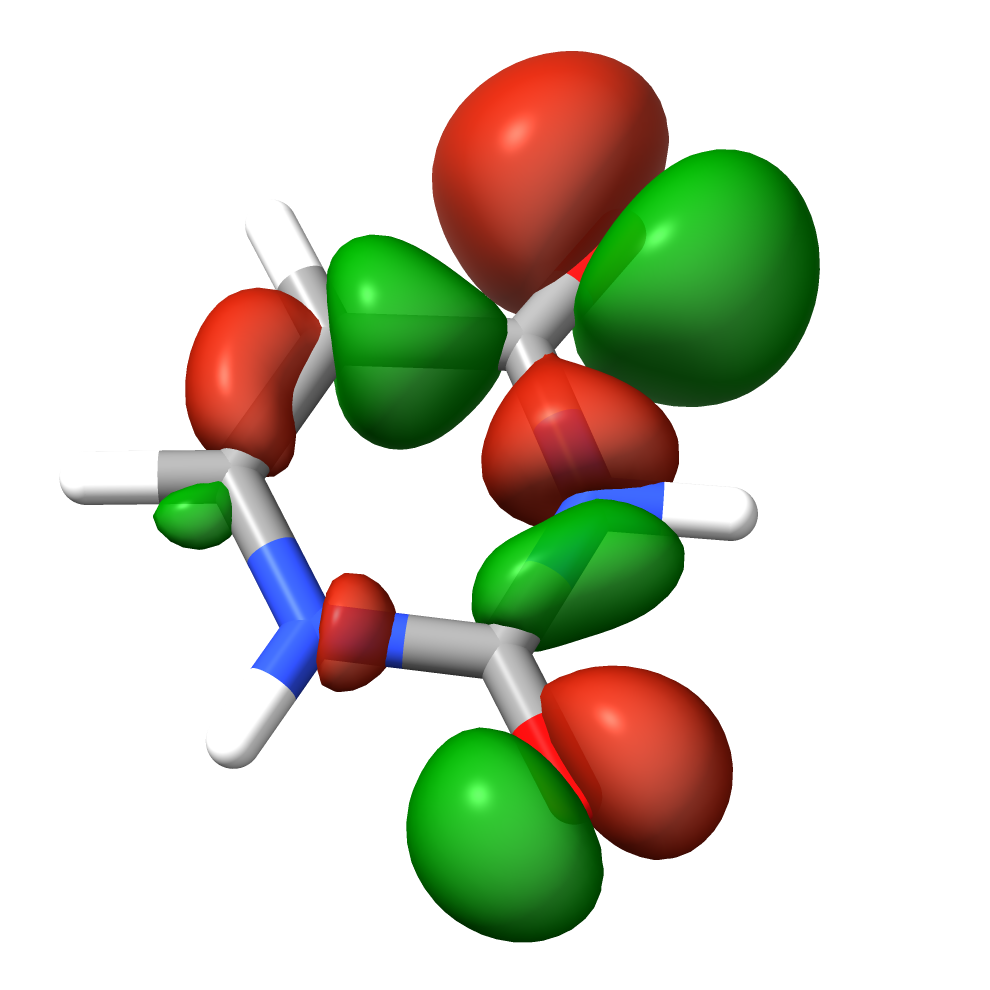
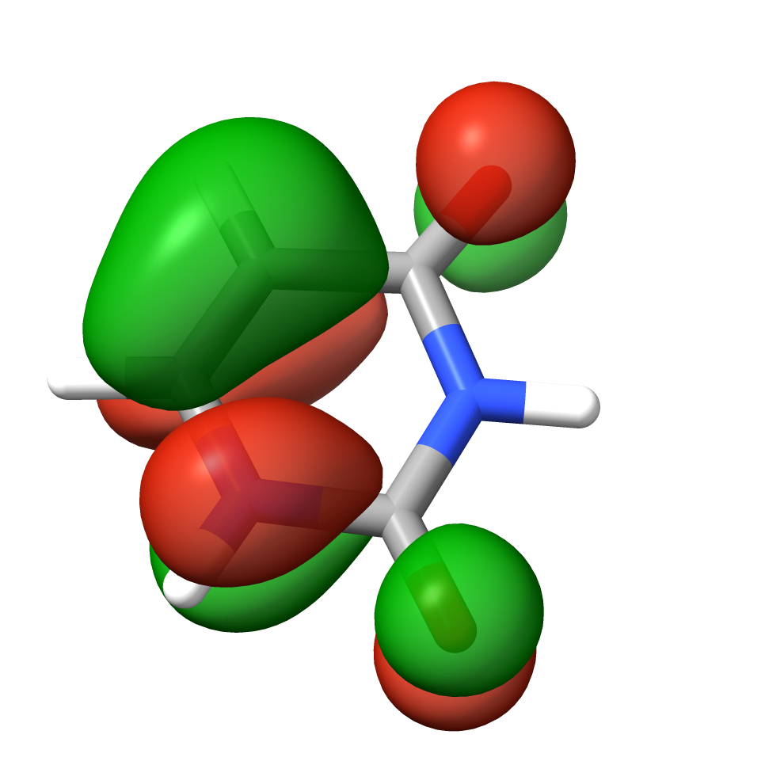
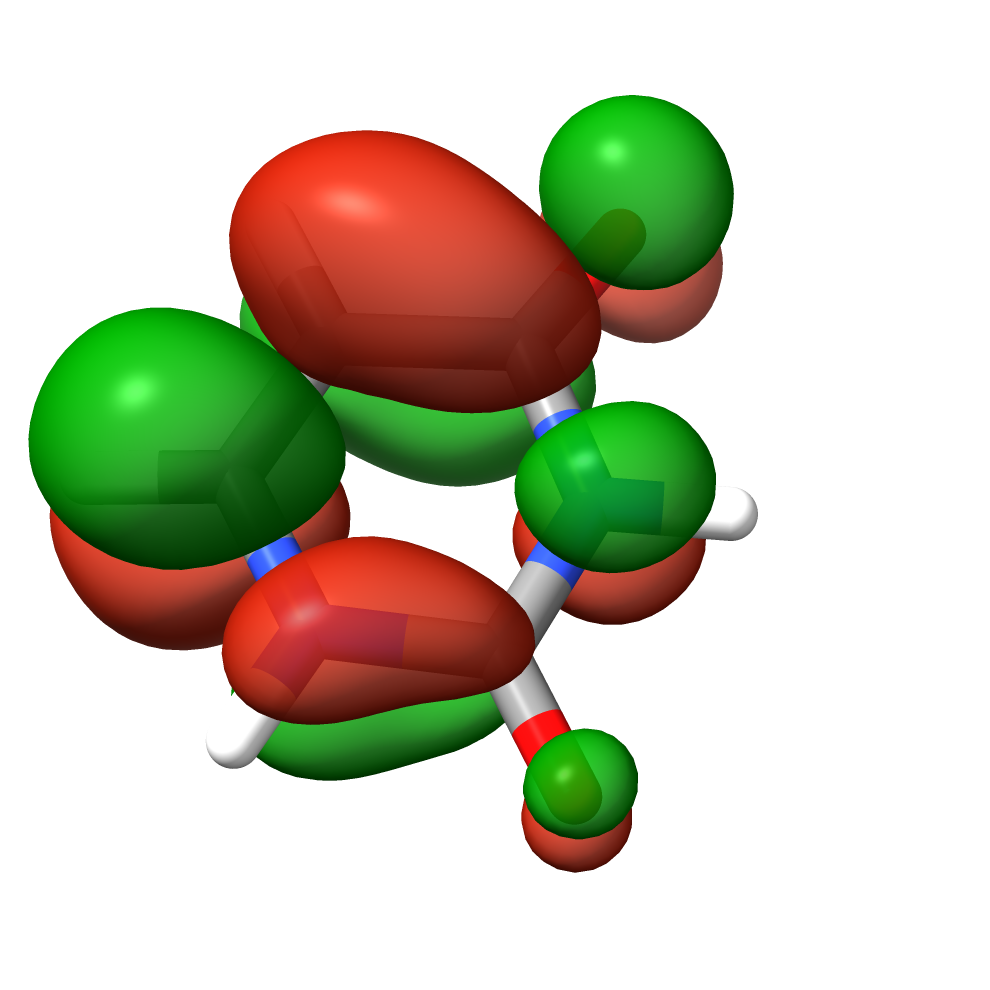
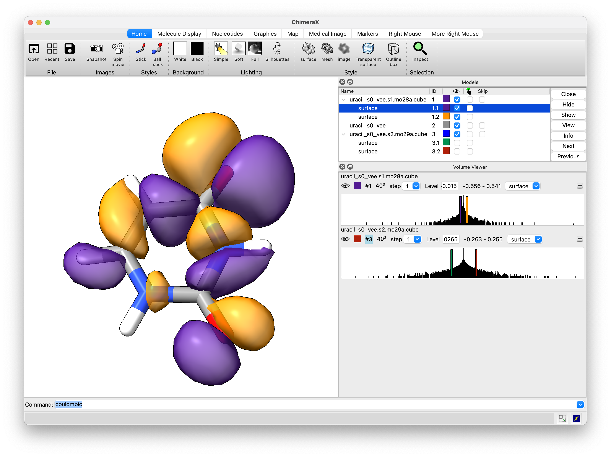
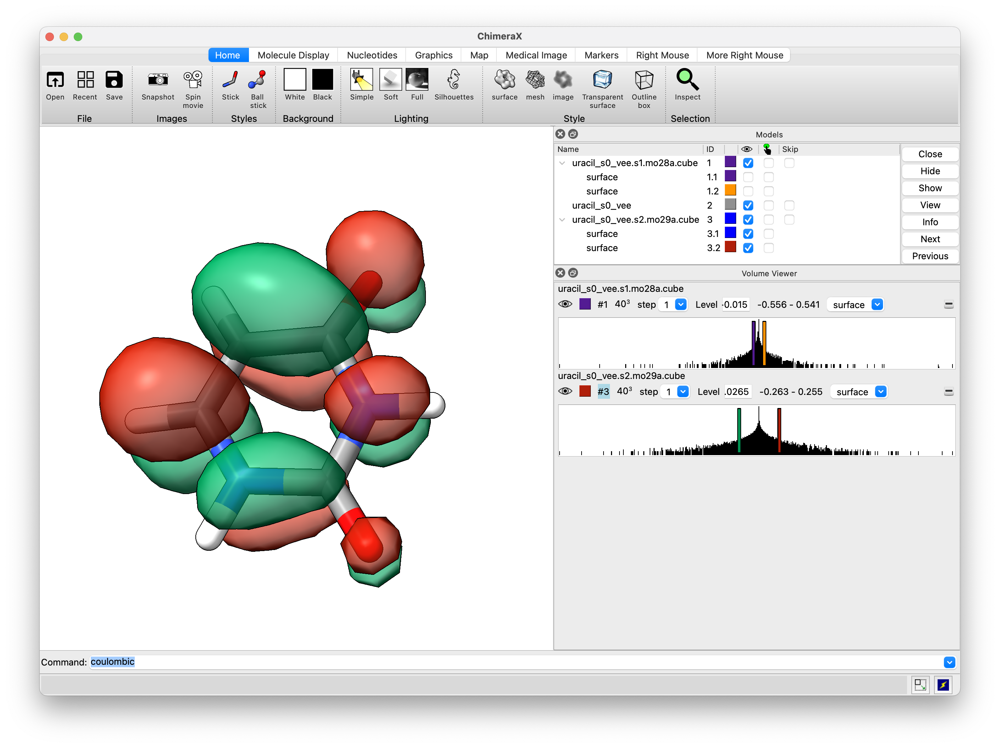
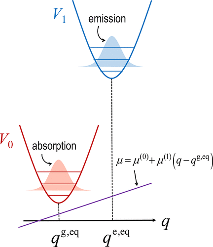
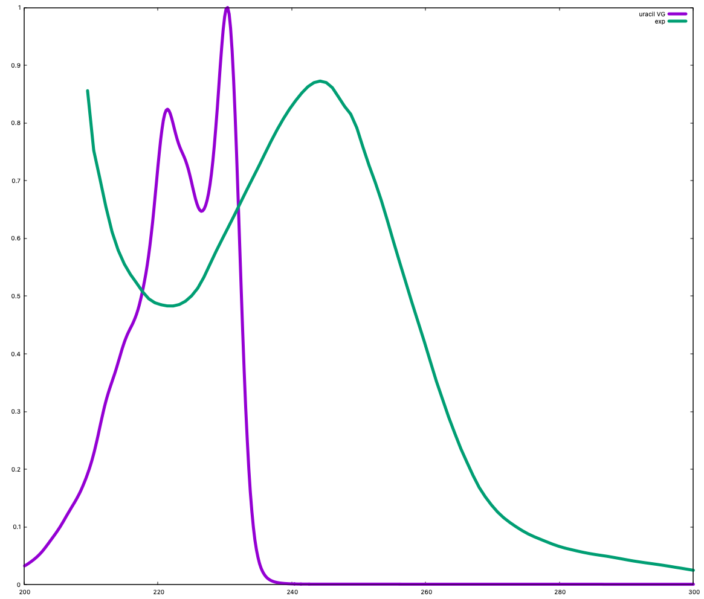

# ORCA Tutorial: Geometry Optimization & UV-vis Spectra of Uracil, Cytosine and Thymine

This tutorial outlines the steps to optimize the geometry of U, T and C nucleobases and compute their vertical excitation spectra using ORCA 6.0.1 package.

## Prerequisites

- **ORCA Installation**: Ensure ORCA is installed on your system. [Installation Guide](https://www.faccts.de/docs/orca/6.0/tutorials/installing-orca.html)
- **Input Files**: Prepare the molecular structure of uracil in an appropriate format (e.g., `.xyz` or `.pdb`).

## Step 1: Geometry Optimization

Create an input file named `uracil_s0.inp` with the following content. Again The starting geometries are available in the article of [article of Lan et al.](https://pubs.acs.org/doi/10.1021/jp809085h) In the supplementary information the relevant geometries of U, T and C are reported.

```plaintext
! pbe0 d4 def2-SVP Opt RIJCOSX Def2/J defgrid3 TightSCF

%geom
    MaxIter 200
    #Convergence tight
end

* xyz 0 1
C   0.7161260117   0.9937054230   0.5446110515  
N   1.5295535430   0.0964202102  -0.1547034571  
C   1.1486238151  -1.1902113468  -0.5167547652  
N  -0.1416009934  -1.5743016712  -0.1391606333  
C  -1.0041440815  -0.7553883162   0.5491894544  
C  -0.6222418826   0.5095480268   0.9031977090  
O   1.8970629335  -1.9704453009  -1.1408395844  
H  -1.2681643439   1.1883874522   1.4453994906  
O   1.1473685821   2.1235378362   0.8224609717  
H   2.4633281615   0.3946765571  -0.4201853029  
H  -0.4305344904  -2.5115764067  -0.3988396958  
H  -2.0011471316  -1.1451087139   0.8039473321  
*
```

>[!NOTE]
>- `! pbe0 d4 def2-SVP Opt`: Specifies the use of the PBE0 hybrid functional with the def2-SVP basis set and D4 empirical dispersion for >geometry optimization.
>- The `* xyz 0 1` block defines the molecular geometry in Cartesian coordinates with a charge of 0 and a multiplicity of 1.

Run the optimization. We could either start an interactive session, load appropriate module and run interactive job:

```bash
sub-interactive
module load ORCA/6.0.1_avx2
orca uracil_s0.inp > uracil_s0.out &
tail -f uracil_s0.out
```
or submit orca job to the SLURM queuing system. We shall normally use the latter approach. In this case the geometry we'll be given in an external file and we'll use 16 cores to speed the calculations and use up to 2000mb per core:

```plaintext
%pal nprocs 16 end
%maxcore 2000
! pbe0 d4 def2-SVP Opt RIJCOSX Def2/J defgrid3 TightSCF

%geom
    MaxIter 200
    #Convergence tight
end

* xyzfile 0 1 uracil_s0_s.xyz 

```

where `uracil_s0_s.xyz` is a regular XYZ file. 

We may submit the job using `sub-orca-6.0.1-avx2` command, which issued without parameters returns it's syntax:

```bash
sub-orca-6.0.1-avx2

orca-6.0.1-avx

Usage: /usr/local/bin/bem2/sub-orca-6.0.1-avx2 FILE PARAMETERS
Parameters:
	-p PARTITION 		 Set partition (queue). Default = normal
	-n NODES 		 Set number of nodes. Default = 1
	-c CORES 		 Up to 48. Default = 6
	-m MEMORY 		 In GB, up to 180 (must be integer value). Default = 30
	-t TIME_LIMIT 		 In hours. Default = 12
```

So to submit our job we should issue the following command (16 cpus times roughly 2gb gives 32gb and we extend the timelimit to 72h of walltime):

```bash
sub-orca-6.0.1-avx2 uracil_s0.inp -c 16 -m 32 -t 72
```

This produces the following output:

```bash
orca-6.0.1-avx

Submitted batch job 3469149
The job is being submitted with the following parameters:

	file            uracil_s0.inp
	partition    normal
	nodes        1
	cores per node 16
	memory       32 GB (per node)
	time limit   72 hours
```

We may monitor our job using `squeue` command:

```bash
squeue --user $USER
```
or even fancier:
```bash
squeue --user $USER --Format jobid:10,name,state:10,timeleft:12,minmemory:10,stdout:100'
```

After completion, the optimized geometry can be found in the output file `uracil_s0.out` (actually the sub-orca script is producing *.orc files but please change that to *.out). Please note that if you use the same filename for XYZ file, that is uracil_s0.inp and uracil_s0.xyz, the latter will be overwritten with the final geometry.

We may use `sacct` command to see the detailed info on the resources used (3470106 is the uniqe job-id):

```bash
sacct --format=jobid,jobname,qos,cputime,ncpu,avecpu,elapsed,avevmsize --jobs=3470106

JobID           JobName        QOS    CPUTime      NCPUS     AveCPU    Elapsed  AveVMSize
------------ ---------- ---------- ---------- ---------- ---------- ---------- ----------
3470106       uracil_s0 hpc-rgora+   00:17:36         16              00:01:06
3470106.bat+      batch              00:17:36         16   00:15:19   00:01:06    911984K
3470106.ext+     extern              00:17:36         16   00:00:00   00:01:06        72K

```

which shows that this job used 17min of cpu time and took roughly 1m.

## Step 2: Vertical Excitation Spectrum Calculation

Using the optimized geometry, create a new input file named `uracil_s0_vee.inp`:

```plaintext
%pal nprocs 16 end
%maxcore 2000
! pbe0 d4 def2-SVP Opt RIJCOSX Def2/J defgrid3 TightSCF

%output
    print[p_mos] 1
    print[p_basis] 2
end

%tddft
    TDA true # TDA approx
    NRoots 8 # number of electronic states
    IRoot 1 # state of interest for calculation of properties
    FollowIRoot true # relevant for excited state geometries
    DoNTO true # for Natural Transition Orbitals
end

* xyzfile 0 1 uracil_s0.xyz
```

Run the TDDFT calculation:

```bash
sub-orca-6.0.1-avx2 uracil_s0_vee.inp -c 16 -m 32 -t 72
```

The vertical excitation energies and oscillator strengths will be reported in the `uracil_s0_vee.out` file. Let us focus on the first two low lying states (S1 and S2).

```plaintext
------------------------------------
TD-DFT/TDA EXCITED STATES (SINGLETS)
------------------------------------

the weight of the individual excitations are printed if larger than 1.0e-02

STATE  1:  E=   0.178366 au      4.854 eV    39146.9 cm**-1 <S**2> =   0.000000 Mult 1
    25a ->  29a  :     0.021596 (c=  0.14695663)
    27a ->  29a  :     0.921544 (c=  0.95997092)
    27a ->  30a  :     0.038202 (c=  0.19545282)
    27a ->  34a  :     0.010999 (c=  0.10487478)

STATE  2:  E=   0.209709 au      5.706 eV    46025.8 cm**-1 <S**2> =   0.000000 Mult 1
    24a ->  29a  :     0.012566 (c= -0.11209819)
    24a ->  30a  :     0.014197 (c=  0.11915057)
    26a ->  29a  :     0.072479 (c=  0.26921873)
    26a ->  30a  :     0.066171 (c=  0.25723737)
    28a ->  29a  :     0.799539 (c=  0.89416965)
    28a ->  34a  :     0.011285 (c=  0.10623135)

[...]

---------------------------------------------------------------------------------------------------
                     ABSORPTION SPECTRUM VIA TRANSITION ELECTRIC DIPOLE MOMENTS
---------------------------------------------------------------------------------------------------
     Transition      Energy     Energy  Wavelength fosc(D2)      D2        DX        DY        DZ
                      (eV)      (cm-1)    (nm)                 (au**2)    (au)      (au)      (au)
---------------------------------------------------------------------------------------------------
  0-1A  ->  1-1A    4.853593   39146.9   255.4   0.000239959   0.00202   0.01607  -0.01595   0.0388
  0-1A  ->  2-1A    5.706475   46025.8   217.3   0.159270387   1.13922   0.19741   0.99831   0.3219

```

The calculated vertical excitations are in reasonable agreement considering the methodology with the experimetal maximum of absorption band, which in vapour is at 5.1 eV (244 nm). [cf. Barbatti et al.](https://pubs.rsc.org/en/content/articlelanding/2010/cp/b924956g). Please note that the vertical excitation corresponds roughly to the 0-0 transition which is not necessarily the most intense one. We shall investigate that later. 

The results are most conveniently visualized using This can be done easily by using [ChimeraX](https://www.faccts.de/docs/orca/6.0/tutorials/first_steps/GUI.html) using the SEQCROW plugin. Open the output file in ChimeraX, then go navigate to `Tools` → `Quantum Chemistry` → `UV/Vis Spectrum`. In the UV/Vis Spectrum window, you can now chose energy for weighting: electronic from the respective drop down menu and the respective plot is visualized under plot. The relevant orbitals can be plotted using the `Orbital Viewer` panel (please note that ORCA is counting from 0 and most visualization programs from 1, thus 28th orbital in ORCA output is actually 29th in ChimeraX.

To copy the files to our local terminal we may use `scp` command (or use MobaXterm sftp functionality). I'll copy all *xyz, *inp and *orc files starting with uracil_s0 to my current directory (.) and rename all *.orc files to *.out:

```bash
scp rgora@ui.wcss.pl:~/photochemistry/uracil/uracil_s0*.{xyz,orc,inp} .
for f in *.orc ; do mv $f ${f/orc/out}; done
```

The S<sub>1</sub> is clearly a <sup>1</sup>nπ<sup>\*</sup> transition (27->29) while S<sub>2</sub> has a <sup>1</sup>ππ<sup>\*</sup> character.

|    |    |    |
|---|---|---|
| Orbital 27 (n)           | Orbital 28 (π)           | Orbital 29 (π*)           |

In this case it is rather obvious but sometimes we may encounter a transition with two 9or more) different and equally important amplitudes. In such a case NTOs are usually much more informative. Since we enabled calculation of NTOs via `DoNTO true` keyword, ORCA produced uracil_s0_vee.s?.nto files. Let us generate the cube files for S1 and S2:

```bash
sub-interactive
module load ORCA/6.0.1_avx2
orca_plot uracil_s0_vee.s1.nto -i 
```

The relevant NTOs for state S1 are 28 (hole) and 29 (particle):

```plaintext
------------------------------------------
NATURAL TRANSITION ORBITALS FOR STATE    1
------------------------------------------
[...]
 E=   0.178366 au      4.854 eV    39146.9 cm**-1
    28a ->  29a  : n=  0.99676652
    27a ->  30a  : n=  0.00247915
```

Thus in the interactive mode we select orbital (option 2) and type the orbital no (28), then we select cube output (option 5 and then 7), save the cube file (option 11). Then we repeat the same procedure for orbital 29 and exit (option 12). Now we generate cube files for NTOs 28 and 29 for S2 state and copy the relevant files to our local terminal.

```bash
scp rgora@ui.wcss.pl:~/photochemistry/uracil/uracil_s0_vee*.{nto,cube} .
```

In this particular case the NTOs are virtually identical to the respective canonical MOs. Below are the NTOs for the S1 state (for a better quality we would have to use denser grid as the default is 40x40x40).

|    |    |
|---|---|
| NTO 28 (n)           | NTO  29 (π*)           |

## Step 3: Calculations of harmonic vibrational frequencies and simmulation of band structure.

Let us prepare the input file for calculations of harmonic vibrational frequencies. 

>[!WARNING]
> These only make sense at a stationary point, thus we have to use the minimum energy structure located using the same methodology.

Let's prepare `uracil_s0_freq.inp` based on a copy of input for geometry optimization:

```bash
cp uracil_s0.inp uracil_s0_freq.inp
vim uracil_s0_freq.inp
```

```plaintext
%pal nprocs 16 end
%maxcore 2000
! pbe0 d4 def2-SVP freq RIJCOSX Def2/J defgrid3 TightSCF

* xyzfile 0 1 uracil_s0.xyz
```

```bash
sub-orca-6.0.1-avx2 uracil_s0_freq.inp -c 16 -m 32 -t 72
```

The normal modes can be visualized using ChimeraX. The output should contain harmonic vibrational frequencies, normal modes vectors, IR spectrum and thermochemical analysis at ambient conditions.

```plaintext
-----------------------
VIBRATIONAL FREQUENCIES
-----------------------

Scaling factor for frequencies =  1.000000000  (already applied!)

     0:       0.00 cm**-1
     1:       0.00 cm**-1
     2:       0.00 cm**-1
     3:       0.00 cm**-1
     4:       0.00 cm**-1
     5:       0.00 cm**-1
     6:     156.13 cm**-1
     7:     173.60 cm**-1
...
    34:    3638.48 cm**-1
    35:    3677.34 cm**-1
```

```plaintext
------------
NORMAL MODES
------------

These modes are the Cartesian displacements weighted by the diagonal matrix
M(i,i)=1/sqrt(m[i]) where m[i] is the mass of the displaced atom
Thus, these vectors are normalized but *not* orthogonal
```

```plaintext
-----------
IR SPECTRUM
-----------

 Mode   freq       eps      Int      T**2         TX        TY        TZ
       cm**-1   L/(mol*cm) km/mol    a.u.
----------------------------------------------------------------------------
  6:    156.13   0.000312    1.57  0.000623  (-0.008951  0.008751 -0.021587)
  7:    173.60   0.000003    0.02  0.000006  ( 0.000896 -0.000843  0.002058)
  8:    396.53   0.004395   22.21  0.003459  (-0.052526 -0.023362  0.012407)
  9:    405.92   0.004174   21.09  0.003209  ( 0.020319 -0.019852  0.049011)
 10:    525.43   0.003520   17.79  0.002091  (-0.003204  0.041795  0.018268)
 11:    553.45   0.001234    6.23  0.000696  ( 0.022267 -0.007294 -0.012109)
 12:    571.37   0.000537    2.71  0.000293  ( 0.015928  0.003722 -0.005071)
 13:    597.72   0.009715   49.09  0.005072  ( 0.025499 -0.024917  0.061652)
 14:    706.08   0.011695   59.10  0.005169  ( 0.025765 -0.025194  0.062211)
 15:    738.94   0.002161   10.92  0.000913  (-0.010792  0.010585 -0.026156)
 16:    789.90   0.000373    1.89  0.000147  ( 0.002436  0.011369  0.003498)
 17:    797.33   0.009108   46.03  0.003565  (-0.021398  0.020914 -0.051669)
 18:    829.55   0.016506   83.41  0.006209  ( 0.028206 -0.027547  0.068227)
 19:    982.78   0.000040    0.20  0.000013  (-0.001218  0.001291 -0.003088)
 20:    986.96   0.000757    3.83  0.000239  (-0.005607  0.012421  0.007334)
 21:   1000.68   0.001248    6.31  0.000389  (-0.018071 -0.006132  0.004997)
 22:   1097.93   0.001453    7.34  0.000413  ( 0.014525  0.014215 -0.000252)
 23:   1211.69   0.014907   75.34  0.003839  (-0.002198  0.057089  0.023986)
 24:   1248.64   0.001697    8.57  0.000424  (-0.009336  0.015348  0.010066)
 25:   1390.97   0.000678    3.43  0.000152  ( 0.011192  0.004298 -0.002886)
 26:   1417.77   0.003893   19.67  0.000857  (-0.026127  0.004202  0.012515)
 27:   1441.29   0.019523   98.66  0.004227  ( 0.060278  0.015806 -0.018538)
 28:   1534.59   0.030793  155.62  0.006262  (-0.061430  0.031938  0.038318)
 29:   1719.41   0.016152   81.63  0.002931  ( 0.017369  0.049636  0.012885)
 30:   1865.38   0.131535  664.73  0.022005  (-0.026106 -0.138810 -0.045333)
 31:   1900.50   0.113736  574.78  0.018676  ( 0.089410 -0.077522 -0.068351)
 32:   3235.60   0.000358    1.81  0.000035  ( 0.004715 -0.002109 -0.002803)
 33:   3280.54   0.000662    3.34  0.000063  ( 0.003843 -0.005738 -0.003908)
 34:   3638.48   0.016757   84.68  0.001437  (-0.034601 -0.012381  0.009311)
 35:   3677.34   0.025847  130.62  0.002193  ( 0.015792  0.042759  0.010757)

* The epsilon (eps) is given for a Dirac delta lineshape.
** The dipole moment derivative (T) already includes vibrational overlap.

The first frequency considered to be a vibration is 6
The total number of vibrations considered is 30
```

```plaintext
--------------------------
THERMOCHEMISTRY AT 298.15K
--------------------------

Temperature         ...   298.15 K
Pressure            ...     1.00 atm
Total Mass          ...   112.09 AMU
Quasi RRHO          ...     True
Cut-Off Frequency   ...     1.00 cm^-1

Throughout the following assumptions are being made:
  (1) The electronic state is orbitally nondegenerate
  (2) There are no thermally accessible electronically excited states
  (3) Hindered rotations indicated by low frequency modes are not
      treated as such but are treated as vibrations and this may
      cause some error
  (4) All equations used are the standard statistical mechanics
      equations for an ideal gas
  (5) All vibrations are strictly harmonic

...

------------
INNER ENERGY
------------

The inner energy is: U= E(el) + E(ZPE) + E(vib) + E(rot) + E(trans)
    E(el)   - is the total energy from the electronic structure calculation
              = E(kin-el) + E(nuc-el) + E(el-el) + E(nuc-nuc)
    E(ZPE)  - the the zero temperature vibrational energy from the frequency calculation
    E(vib)  - the the finite temperature correction to E(ZPE) due to population
              of excited vibrational states
    E(rot)  - is the rotational thermal energy
    E(trans)- is the translational thermal energy

Summary of contributions to the inner energy U:
Electronic energy                ...   -414.08127160 Eh
Zero point energy                ...      0.08855807 Eh      55.57 kcal/mol
Thermal vibrational correction   ...      0.00322154 Eh       2.02 kcal/mol
Thermal rotational correction    ...      0.00141627 Eh       0.89 kcal/mol
Thermal translational correction ...      0.00141627 Eh       0.89 kcal/mol
-----------------------------------------------------------------------
Total thermal energy                   -413.98665946 Eh

--------
ENTHALPY
--------

The enthalpy is H = U + kB*T
                kB is Boltzmann's constant
Total thermal energy              ...   -413.98665946 Eh
Thermal Enthalpy correction       ...      0.00094421 Eh       0.59 kcal/mol
-----------------------------------------------------------------------
Total Enthalpy                    ...   -413.98571525 Eh

...

-------
ENTROPY
-------

The entropy contributions are T*S = T*(S(el)+S(vib)+S(rot)+S(trans))
     S(el)   - electronic entropy
     S(vib)  - vibrational entropy
     S(rot)  - rotational entropy
     S(trans)- translational entropy
The entropies will be listed as multiplied by the temperature to get
units of energy

Electronic entropy                ...      0.00000000 Eh      0.00 kcal/mol
Vibrational entropy               ...      0.00505592 Eh      3.17 kcal/mol
Rotational entropy                ...      0.01321510 Eh      8.29 kcal/mol
Translational entropy             ...      0.01903286 Eh     11.94 kcal/mol
-----------------------------------------------------------------------
Final entropy term                ...      0.03730387 Eh     23.41 kcal/mol

...

-------------------
GIBBS FREE ENERGY
-------------------

The Gibbs free energy is G = H - T*S

Total enthalpy                    ...   -413.98571525 Eh
Total entropy correction          ...     -0.03730387 Eh    -23.41 kcal/mol
-----------------------------------------------------------------------
Final Gibbs free energy         ...   -414.02301912 Eh

For completeness - the Gibbs free energy minus the electronic energy
G-E(el)                           ...      0.05825248 Eh     36.55 kcal/mol
```

>[!NOTE]
> Please note that the electronic energy of -414.08127160 Eh **does include** the empirical D4 correction of -0.009750613 which is not included in vertical excitation spectra (it's simply the same for all the states as it depends only on the geometry).



The working directory should contain a Hessian file `uracil_s0_freq.hess` which is a plain text file. Having only ground state Hessian we may simmulate the band structure using the [Vertical Gradient (VG)](https://www.faccts.de/docs/orca/6.0/manual/contents/typical/esd.html#the-simplest-model-vertical-gradient-vg) or Adiabatic Hessian After a Step (AHAS) approaches (the latter being more accurate). Below is an example of input file. VG method requires excited state gradients at the GS geomeetry to estimate the displaced geometry. In this case we are also performing calculations for two lowest-lying states including Herzberg-Teller vibronic couplings which require calculation of derivatives of transition dipole moments. Thus such computations may be time consuming.

A schematic on the right is taken form [Kundu et al.](https://pubs.acs.org/doi/10.1021/acs.jpcb.2c00846) showing the two potential energy surfaces along a vibrational coordinate q and the initially equilibrated densities for absorption and emission spectra. They assumed linear dipole moment function.

<br clear="right"/>&nbsp;

```plaintext
%pal nprocs 16 end
%maxcore 2000
! pbe0 d4 def2-SVP RIJCOSX Def2/J defgrid3 TightSCF ESD(ABS)

%tddft
    TDA true # TDA approx
    NRoots 3 # number of electronic states
end

%ESD
  GSHESSIAN  "uracil_s0_freq.hess"
  DOHT       TRUE
  STATES     1,2
  UNIT       NM
  HESSFLAG   VG
  LINEW      100
  INLINEW    300
  LINES      GAUSS
  SPECRANGE  10000,50000
  UNIT       NM
  PRINTLEVEL HIGH
  USEJ       FALSE
  COORDSYS   INT
END

* xyzfile 0 1 uracil_s0.xyz
```

After successfull completion the directory should contain `uracil_s0_vg.spectrum` and `uracil_s0_vg.spectrum.root?` files for a total spectrum and particular states, respectively. We may plot this using GNUPlot (or any other plotting program). The obtained spectrum is essentially due to S2. To plot this spectrum w.r.t. energies in eV use the following:

```gnuplot
plot [200:250] 'uracil_s0_vg.spectrum' u 1:2 w l t 'uracil VG'
plot [5:6.2] 'uracil_s0_vg.spectrum' u (1239.8/$1):2 w l lw 5 t 'uracil VG'
plot [5:6.2] 'uracil_s0_vg.spectrum.root2' u (1239.8/$1):2 w l lw 5 t 'uracil VG S2'
```

Now lets compare this with experimental data. BTW I extracted these from [Clark et al. 1965 paper](https://pubs.acs.org/doi/abs/10.1021/j100894a063) by taking a snapshot and using the [WebPlotDigitizer 4.8](https://apps.automeris.io/wpd4/) - it's fairly intuitive. The agreement is far from perfect but so is the approach that we've used.



```gnuplot
# statistical analysis of the data to get max values (A_max_y)
stats 'uracil_s0_vg.spectrum.root2' using 1:2 name "A"
# here we plot the notmalized VG and experimental data
plot [200:300] 'uracil_s0_vg.spectrum.root2' u 1:($2/A_max_y) w l lw 5 t 'uracil VG',\
               'uracil_exp.spectrum' u 1:2 smooth csplines w l lw 5 t 'exp'
```

<br clear="right"/>&nbsp;


## References

For more detailed information, refer to the [ORCA 6.0 Tutorials](https://www.faccts.de/docs/orca/6.0/tutorials/).
